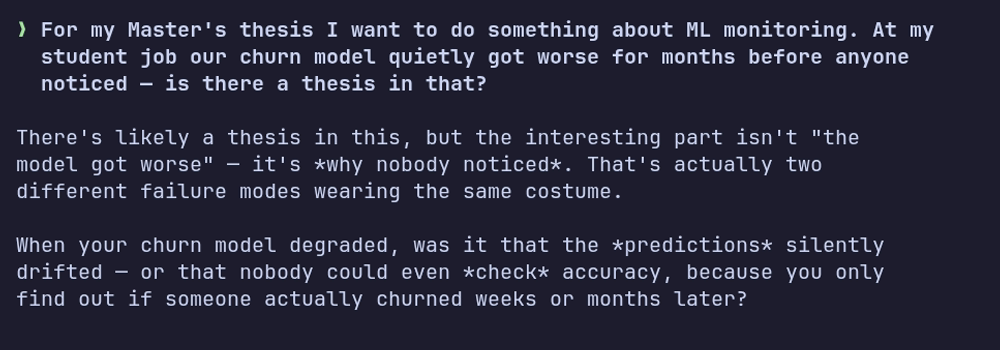
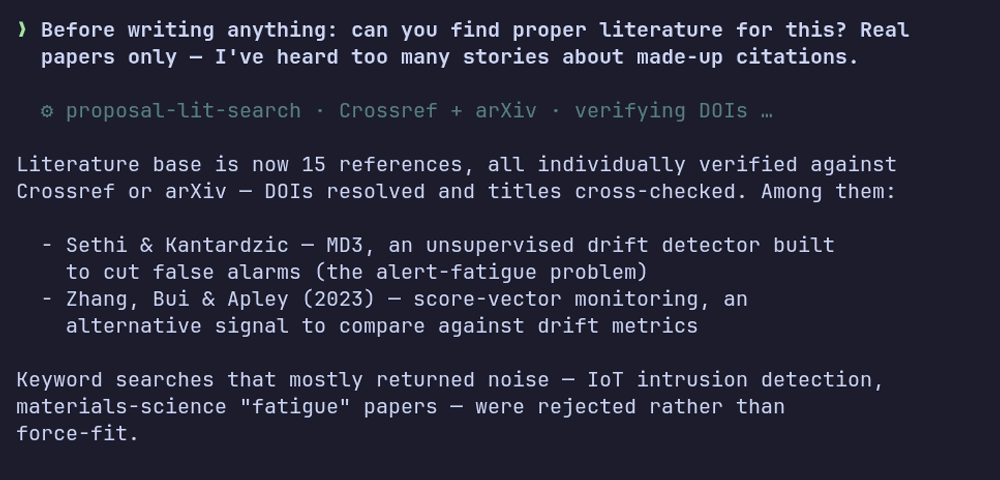
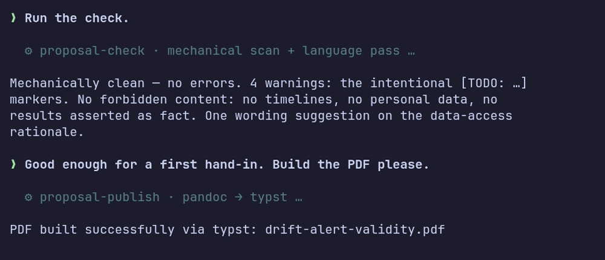

# Thesis Proposal Skills

Write a convincing Bachelor's or Master's thesis proposal with the help of an AI agent, in English or German.

A real agent session, condensed — a student turns a work anecdote into a proposal:





This repository contains a set of **agent skills**: instruction packages that teach an AI coding agent (Claude Code, Cursor, Codex, and many others) how to guide you from a vague idea to a polished, literature-grounded proposal. You install the skills once; afterwards you only ever work on your own proposal files, in your own folder. You never need to touch this repository.

**Never used an AI agent before?** Start with [docs/getting-started.md](docs/getting-started.md), which walks you through installing an agent from zero.

## What the skills do

| Skill | What it does for you |
|---|---|
| `proposal-ideate` | Develops your rough idea with you through Socratic questions and early literature checks (is this already solved?), then captures the result in a proposal file. |
| `proposal-lit-search` | Finds real, relevant academic literature (DBLP, Crossref, arXiv, OpenCitations, Semantic Scholar, OpenAlex), by topic or by snowballing from papers you already have. |
| `proposal-write` | Writes or refines the proposal following proven structure and writing rules. It never invents facts or references. |
| `proposal-import` | Converts an existing proposal (usually a PDF) into the workable format and strips personal data. |
| `proposal-check` | Fast mechanical check: required sections, citation consistency, forbidden content, leftover TODOs. |
| `proposal-review` | Supervisor-style content review with numbered, actionable suggestions. |
| `proposal-publish` | Optional: builds a compact PDF via pandoc with typst or an existing LaTeX installation. A plain markdown hand-in is fine too. |
| `proposal-customize` | Adapts everything to your supervisor's requirements ("timeline required", "max 3 pages"). |

Your whole proposal lives in **one file**: readable text on top, literature entries at the bottom. Many proposals can sit side by side in one folder.

## Quick start

1. Get an AI agent (see [docs/getting-started.md](docs/getting-started.md) if you don't have one).
2. Create a folder for your proposals and open your agent in it.
3. Install the skills:
   ```sh
   npx skills add hutzelmann/thesis-proposal-skills
   ```
4. Tell your agent: *"Help me develop a thesis idea"*, or *"Import my existing proposal from proposal.pdf"*.

The typical flow is ideate, then literature search, then write, check, review, and finally publish. Every skill also works on its own. PDF building is optional; install `pandoc` and `typst` only when you want it (the publish skill tells you how).

## For supervisors

The skills encode conservative academic guidance: analytical research questions (not implementation goals), a single methodology, explicit contribution over the state of the art, no fabricated references, and visible TODO markers for every gap. Students can adapt the rules to your requirements with `proposal-customize`. The defaults forbid timelines, personal data, and expected-results sections.

## For contributors (this repository)

This repo is **only** for developing and testing the skills. User proposals never live here.

- Specs are the source of truth: `openspec/specs/`, managed with [OpenSpec](https://github.com/Fission-AI/OpenSpec). Every change runs propose, review, apply, archive. Agent integration files are not committed; run `openspec init --tools <your-agent>` once locally (and `openspec update` after CLI upgrades).
- `shared/` holds the single-source guidance; `scripts/sync_shared.py` materializes it — and the cross-skill script copies — into the skills. Activate the pre-commit hook once per clone with `git config core.hooksPath .githooks` — it re-materializes and stages the copies on every commit; CI's `--check` catches bypassed hooks.
- Tests: `uv run pytest` runs L0 without model calls; `harness/` holds the L1/L2 model evals (see `harness/README.md`).
- Fixtures in `tests/fixtures/` are synthetic: no real proposals, no personal data.

MIT licensed. Issues and PRs welcome; please open an issue first.
